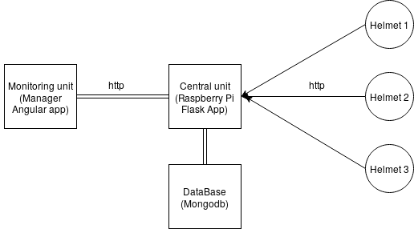

=====

| NodeMCU  ||  IoT  ||  Angular  ||  Flask  ||  MongoDB

=====

# SMART-HELMET (for mining industry)

Smart Helmet is light weight helmet with some minimal cost materials that could collect significant information which gives clues about the situation of the miner, then the data needs to be sent through a certain network so finally it would be treated and studied to decide if it tells us about the existence of a dangerous event or not triggering the process of alerting a miner about the danger he or his associates are in.

## Project repositories
the Project consiste of three parts:

* Helmet Node: https://github.com/philomath213/smart-helmet-nodemcu
* Central Unit: https://github.com/philomath213/smart-helmet-api
* Monitoring Unit: https://github.com/philomath213/smart-helmet-ng

## Architecture

### Sensors

To keep the solution cheap enough to be realized we have chosen only the most important sensors that will help us collect the most significant data. In our helmet design we will be using a DHT sensor to capture the humidity and temperature around the worker, the air quality sensor basically to detect the levels of mono dioxide in the air, helmet removal detector which is an IR sensor putted in the helmet and a pressure sensor to tell us about the worker situation if a collapse event had happened.

### The Helmet Communication Unit

In order to collect the data then send it, our helmet needs to use a board which allows wireless communication with a good range and a great wall penetration because mines have some hard resistance because of the depth under the earth and it wall’s are made of clay. We choose to use Node MCU Lolin because of the wifi support integrated, the reduced size of the board and for it low cost and consumption.

### The Central Unit

This unit is used to process the data collected earlier, retrieve important information and then take the decision about alerting workers following a certain list of rules, our central unit is a Raspberry Pi in which we deployed a Flask RestFull API to take the data in store it in a database (MongoDB) return the actual situations of all the workers to be monitored and of course alert any anomaly if found.

### The Monitoring Unit

The final step is to represent this data so that supervisors could make use of it, so the monitoring interface should be simple and significant and any hazardous event representation must be obvious. For the monitoring we have developed a web application using Angular which displays a table of the current information about all the helmets, the averages of Temperature/Humidity/mono-dioxide  measurements, the number of removed helmets, and in the abnormal conditions this interface will highlight the helmets that lost connection to the central unit, the helmets under pressure (danger that mine had collapsed on him for example), or the individuals who got high Temperature/mono-dioxide measurements.

### The Alerting System 

If a dangerous event happens the monitoring unit will display it to for the supervising team above but we need to alert our workers who are underground in the dark surrounded by noise, the first alert action we provided is the blinking of the helmet light a few times and after that a notification system will send emails to all workers telling them about the specification of the situation.     

### The Network

Establishing such a network and in mine located hundred of meters under the ground and surrounded by caly is the challenge that we found very hard to get over in our project and till now this point still undecided, our idea is to build a network that connect the node to any node it can be reached so that any worker’s helmet would be an access point so finally we can connect them to the central unit,by the way we have discussed that the central unit (raspberry pi) must be inside the mine at least at the entry point where all the differents groups meet before they separate and we will connect this last with the monitoring room with a wired connection (optic fiber for example).
